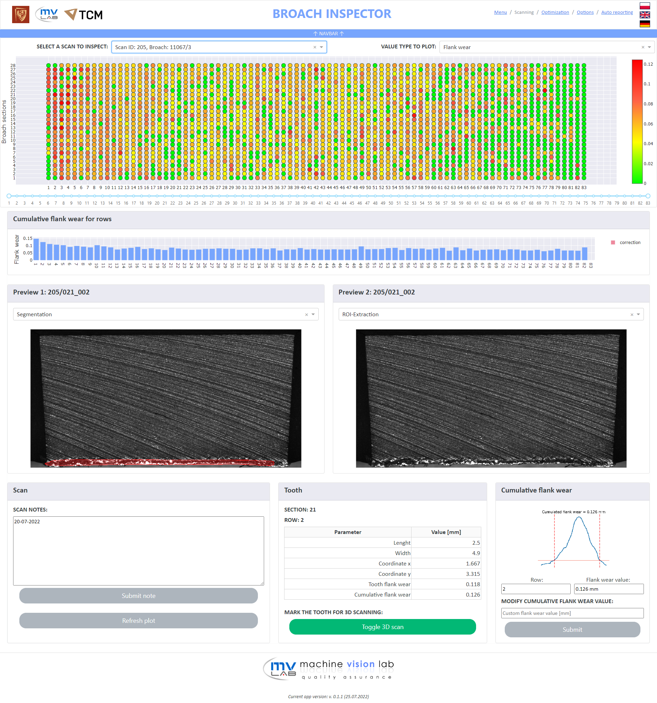
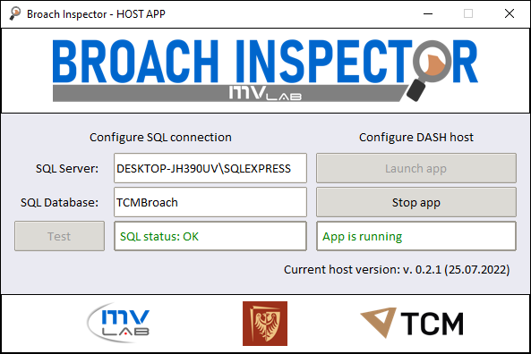
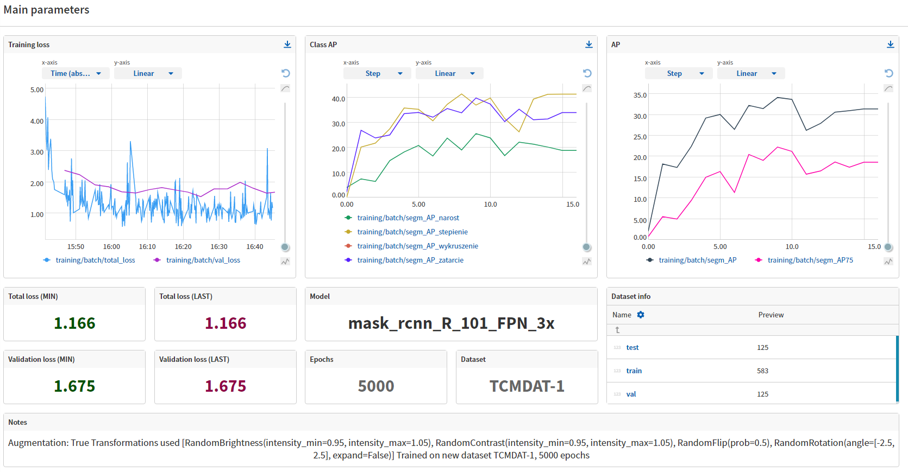
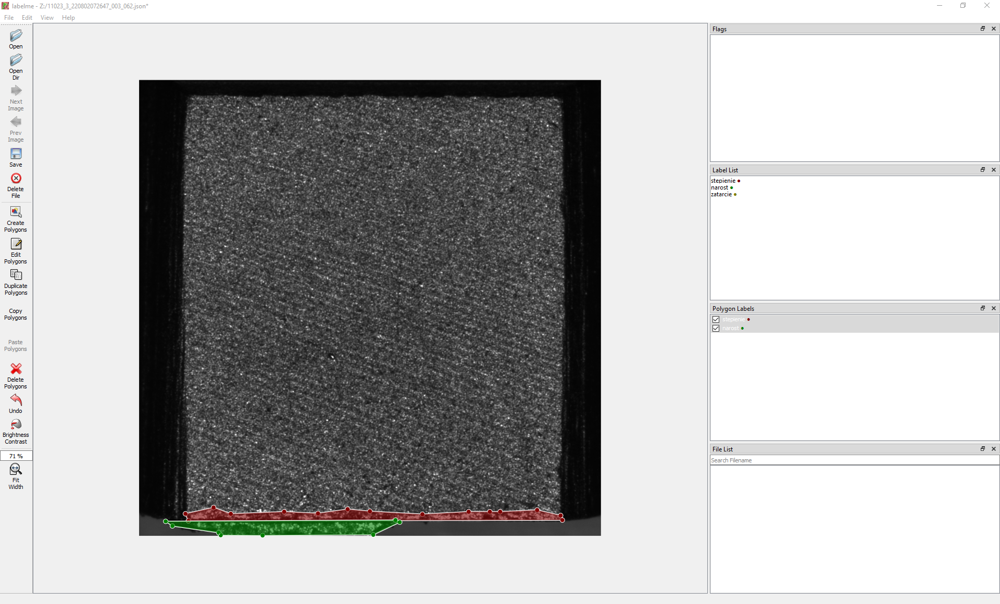

# TCM Broach Inspector

Multifunctional system for automatic visual inspection of broach teeth, featuring:
* 2-stage AI based image processing system (ROI-extraction and failure segmentation)
* 3D analysis system
* Module for teeth sharpening strategy optimization
* Dash based interactive application
* TKinter based host application

## Table of Contents
* [General Info](#general-information)
* [Technologies Used](#technologies-used)
* [Features](#features)
* [Project Status](#project-status)
* [Experiments tracking](#experiments-tracking)

## General Information

- Contains jupyter notebooks for models development purposes
- ResNET architecture
- Failures annotations in .json format, compatible with LabelMe
- Supervized learning with custom datasets
- Semi-automatic dataset creation
- Custom evaluation methods with modified F1-score
- Models comparing and results tracking with Neptune.AI
- Results displayed in dash-based interactive application
- Module for teeth sharpening strategy optimization
- Input and output data stored in SQL database

## Technologies Used

- Python 3.7.0
- Detectron2 v0.6
- PyTorch 1.11.0
- Pandas 1.3.5
- OpenCv 4.5.1
- NumPy 1.21.3
- Dash 2.1.0
- Json 2.0.9
- NVIDIA CUDA 11.3

## Features

**Dash application used for output visualization.**
>

**TKinter based host application with console output**
>

**MLOPs platform - Neptune AI for experiments tracking pourposes.**
>

**Automatic labels in .json lableme compatible format, generated using detectron2 model inference.**
>

## Project Status

Project is: _in progress_ 

## Experiments tracking

Neptune [click here](https://app.neptune.ai/kacper-marciniak/)
