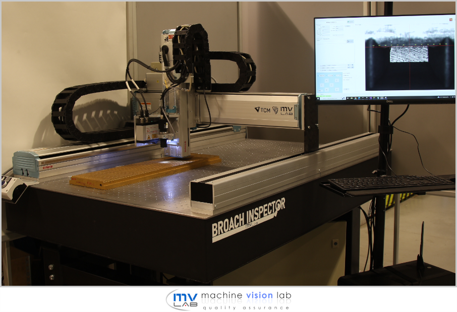

# TCM Broach Inspector

## Overview

The **TCM Broach Inspector** is an advanced, multifunctional system designed for the automatic inspection of flat broaching tools. It combines advanced ML and 3D analysis technologies to enhance efficiency, precision, and cost-effectiveness in tool maintenance processes.

### Key Features:

- **2-stage ML-driven image processing**:
  - Detection of tooth rake faces.
  - Segmentation of surface defects and failures.
- **3D analysis system**:
  - Laser profilometer for measuring tooth height and detecting surface anomalies.
- **Cost optimization module**:
  - Suggests optimal reconditioning methods to maximize lifecycle profitability.
- **Interactive Dash application**:
  - Enables result visualization, selection of reconditioning strategies, and generation of detailed tool scan reports.
- **SQL database**:
  - Secure storage for scan results and analysis data.

---

## Machine Learning Solutions

- **Detectron2 models** powered by ResNet architecture.
- Supervised learning with **custom-built datasets**.
- Seamless annotation compatibility with **LabelMe software**.
- **Semi-automatic dataset creation** system.
- Proprietary evaluation methods, including a customized F1 metric.
- Model comparison and performance tracking via **Neptune.AI**.
- **MLOps support** with ML error reporting and in-app relabeling.

---

## Visualization and Reporting

The project includes a powerful visualization application to analyze and interpret inspection results effectively:

### Examples:

**Broach Wear Map**  
Detailed visualization of tool wear across the surface.  

**Wear Analysis by Rows**  
Graphical representation of wear for each row.  

**Artifact and Surface Inspection**  
Interactive preview of apposition surfaces and identified defects.  

---

## Video Demonstration

Learn more about the **Broach Inspector** by watching our demonstration video on YouTube.

  

---

## Collaborators

This project is a joint effort of industry leaders and academic institutions, reflecting a commitment to innovation and excellence.

<table>
  <tr>
    <th><a href="https://pwr.edu.pl/">Wrocław University of Science and Technology</a></th>
    <th><a href="https://mvlab.pl/">Machine Vision Laboratory</a></th>
    <th><a href="https://www.tcm-international.com/">TCM International</a></th>
  </tr>
  <tr>
    <td width=33%>

</td>
    <td width=33%>

</td>
    <td width=33%>

</td>
  </tr>
</table>

